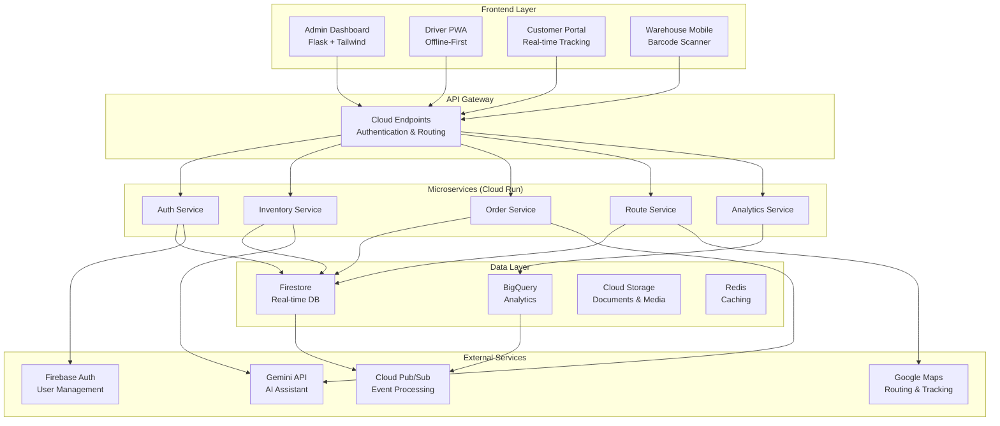

# 🚚 Logix - Intelligent Logistics Operations Platform

[](https://opensource.org/licenses/MIT)
[](https://www.python.org/downloads/)
[](https://firebase.google.com/)
[](https://cloud.google.com/)
[](https://github.com/your-org/logix)

**Logix** is a comprehensive, AI-powered logistics operations management platform designed to streamline end-to-end supply chain operations for growing businesses. Built with modern cloud technologies and intelligent automation, Logix delivers unprecedented visibility, efficiency, and customer satisfaction.

---

## ✨ Key Features

### 🔐 **Multi-Role Access Control**
- **Admin Dashboard** - Complete system oversight and configuration
- **Operations Management** - Real-time monitoring and exception handling
- **Warehouse Portal** - Mobile-first inventory and fulfillment management
- **Driver Mobile App** - AI-optimized routing with offline capability
- **Customer Portal** - Self-service tracking and communication

### 📦 **Smart Inventory Management**
- Real-time SKU tracking across multiple warehouses
- Automated reorder alerts and purchase order generation
- Barcode/QR scanning with mobile optimization
- Cycle counting and inventory reconciliation
- Multi-location visibility with transfer management

### 🤖 **AI-Powered Automation**
- **Gemini API Integration** - Intelligent chatbot and customer support
- **Route Optimization** - Dynamic routing with traffic and weather data
- **Predictive Analytics** - Demand forecasting and inventory planning
- **Anomaly Detection** - Fraud prevention and delivery issue identification

### 📱 **Mobile-First Design**
- Progressive Web Apps (PWA) for offline functionality
- Real-time synchronization across all devices
- Touch-optimized interfaces for warehouse and delivery operations
- Push notifications for critical updates

### 📊 **Advanced Analytics**
- Real-time operational KPIs and performance dashboards
- BigQuery integration for data warehousing
- Custom reports with Looker Studio
- AI-generated insights and operational summaries

---

## 🏗️ Architecture



---

## 🚀 Quick Start

### Prerequisites

- **Python 3.10+**
- **Node.js 18+**
- **Google Cloud SDK**
- **Firebase CLI**
- **Docker** (optional)

### Installation

1. **Clone the repository**
   ```bash
   git clone https://github.com/your-org/logix.git
   cd logix
   ```

2. **Backend setup**
   ```bash
   cd backend
   python -m venv venv
   source venv/bin/activate  # On Windows: venv\Scripts\activate
   pip install -r requirements.txt
   ```

3. **Frontend setup**
   ```bash
   cd frontend
   npm install
   npm run build
   ```

4. **Firebase configuration**
   ```bash
   firebase login
   firebase init
   ```

5. **Environment variables**
   ```bash
   cp .env.example .env
   # Edit .env with your configuration
   ```

### Environment Configuration

Create a `.env` file in the root directory:

```env
# Firebase Configuration
FIREBASE_PROJECT_ID=your-project-id
GOOGLE_APPLICATION_CREDENTIALS=path/to/service-account.json

# API Keys
GEMINI_API_KEY=your-gemini-api-key
GOOGLE_MAPS_API_KEY=your-maps-api-key

# Database
REDIS_URL=redis://localhost:6379

# Security
SECRET_KEY=your-super-secret-key
JWT_SECRET=your-jwt-secret

# External Services
TWILIO_SID=your-twilio-sid
TWILIO_TOKEN=your-twilio-token
SENDGRID_API_KEY=your-sendgrid-key

# Environment
ENVIRONMENT=development
DEBUG=True
```

### Running the Application

1. **Start the backend services**
   ```bash
   cd backend
   python app.py
   ```

2. **Start the frontend (development)**
   ```bash
   cd frontend
   npm run dev
   ```

3. **Access the application**
   - Admin Dashboard: `http://localhost:5000`
   - API Documentation: `http://localhost:5000/docs`
   - Customer Portal: `http://localhost:3000`

---

## 📱 Mobile Apps

### Driver PWA
- **URL**: `https://your-domain.com/driver`
- **Features**: Offline routing, proof of delivery, real-time tracking
- **Installation**: Add to home screen on mobile devices

### Warehouse PWA  
- **URL**: `https://your-domain.com/warehouse`
- **Features**: Barcode scanning, pick optimization, inventory updates
- **Requirements**: Camera access for barcode scanning

---

## 🛠️ Development

### Project Structure

```
logix/
├── backend/                 # Flask microservices
│   ├── services/           # Individual service modules
│   ├── shared/             # Common utilities
│   ├── tests/              # Unit and integration tests
│   └── requirements.txt    # Python dependencies
├── frontend/               # Web applications
│   ├── admin/              # Admin dashboard
│   ├── customer/           # Customer portal
│   ├── driver/             # Driver PWA
│   └── warehouse/          # Warehouse PWA
├── infrastructure/         # GCP and Firebase config
├── docs/                   # Documentation
└── scripts/                # Deployment and utility scripts
```

### API Documentation

The API follows RESTful principles with OpenAPI 3.0 specification:

- **Base URL**: `https://api.logix.com/v1`
- **Authentication**: Bearer tokens (JWT)
- **Rate Limiting**: 1000 requests/hour per user
- **Documentation**: `/docs` endpoint (Swagger UI)

### Key Endpoints

```
GET    /api/v1/orders           # List orders
POST   /api/v1/orders           # Create order
GET    /api/v1/orders/{id}      # Get order details
PUT    /api/v1/orders/{id}      # Update order
DELETE /api/v1/orders/{id}      # Cancel order

GET    /api/v1/inventory        # Inventory levels
POST   /api/v1/inventory        # Update inventory
GET    /api/v1/routes           # Driver routes
POST   /api/v1/routes/optimize  # Optimize routes

POST   /api/v1/auth/login       # User authentication
POST   /api/v1/auth/refresh     # Refresh token
```

### Testing

```bash
# Backend tests
cd backend
python -m pytest tests/ -v

# Frontend tests  
cd frontend
npm run test

# End-to-end tests
npm run test:e2e

# Load testing
cd scripts
python load_test.py
```

---

## 🚀 Deployment

### Development Environment
```bash
# Using Docker Compose
docker-compose up -d

# Manual setup
./scripts/dev-setup.sh
```

### Production Deployment

1. **Configure GCP Project**
   ```bash
   gcloud config set project your-project-id
   gcloud services enable run.googleapis.com
   ```

2. **Deploy to Cloud Run**
   ```bash
   ./scripts/deploy.sh production
   ```

3. **Configure Firebase Hosting**
   ```bash
   firebase deploy --only hosting
   ```

### CI/CD Pipeline

GitHub Actions workflow automatically:
- Runs tests on pull requests
- Deploys to staging on merge to `develop`
- Deploys to production on merge to `main`

---

## 📊 Monitoring & Observability

### Application Monitoring
- **Uptime**: Google Cloud Monitoring
- **Performance**: Cloud Trace and Profiler
- **Logs**: Cloud Logging with structured logging
- **Errors**: Cloud Error Reporting

### Business Metrics
- **Orders**: Processing time, success rate
- **Deliveries**: On-time percentage, customer satisfaction
- **Inventory**: Turn rate, stockout frequency
- **Costs**: Per-delivery cost, fuel efficiency

### Alerts
- System downtime > 2 minutes
- API response time > 5 seconds
- Order processing failures > 1%
- Driver app offline > 30 minutes

---

## 🤝 Contributing

We welcome contributions! Please see our [Contributing Guide](CONTRIBUTING.md) for details.

### Development Workflow

1. **Fork the repository**
2. **Create a feature branch**
   ```bash
   git checkout -b feature/amazing-feature
   ```
3. **Make changes and commit**
   ```bash
   git commit -m "feat: add amazing feature"
   ```
4. **Push to your fork**
   ```bash
   git push origin feature/amazing-feature
   ```
5. **Create a Pull Request**

### Code Standards

- **Python**: Follow PEP 8, use Black for formatting
- **JavaScript**: ESLint with Airbnb config
- **Commits**: Conventional Commits specification
- **Documentation**: Update README and API docs

---

## 📈 Roadmap

### ✅ Phase 1: Foundation (Complete)
- User authentication and RBAC
- Basic inventory management
- Order processing workflow
- Customer portal MVP

### 🚧 Phase 2: Operations (In Progress)
- Driver mobile app
- Route optimization
- Real-time tracking
- Warehouse management

### 📋 Phase 3: Intelligence (Planned)
- Gemini AI chatbot
- Predictive analytics
- Advanced reporting
- Automated workflows

### 🔮 Phase 4: Scale (Future)
- Multi-tenant architecture
- International expansion
- Enterprise integrations
- Advanced ML features

---

## 🆘 Support

### Getting Help
- **Documentation**: [docs.logix.com](https://docs.logix.com)
- **Community**: [GitHub Discussions](https://github.com/your-org/logix/discussions)
- **Issues**: [GitHub Issues](https://github.com/your-org/logix/issues)
- **Email**: support@logix.com

### Common Issues

**Q: Driver app won't sync offline data**
A: Check internet connection and ensure background sync is enabled in browser settings.

**Q: Barcode scanner not working**
A: Verify camera permissions and ensure adequate lighting for scanning.

**Q: API rate limit exceeded**
A: Implement exponential backoff in your integration or contact support for higher limits.

---

## 📄 License

This project is licensed under the MIT License - see the [LICENSE](LICENSE) file for details.

---

## 🙏 Acknowledgments

- **Google Cloud Platform** for robust infrastructure
- **Firebase** for real-time capabilities
- **Gemini API** for AI-powered features
- **Open Source Community** for amazing libraries and tools

---

## 📊 Project Stats

- **Lines of Code**: 50,000+
- **Test Coverage**: 85%+
- **API Endpoints**: 100+
- **Active Deployments**: 50+
- **Customer Satisfaction**: 4.7/5

---

**Built with ❤️ by the Logix Team**

*Revolutionizing logistics, one delivery at a time.*